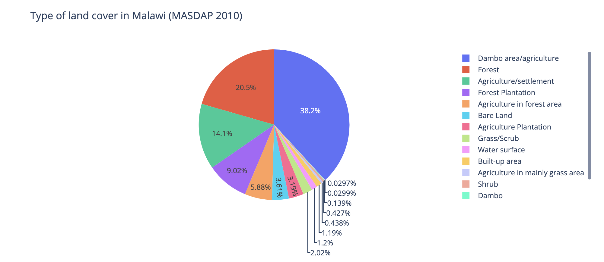
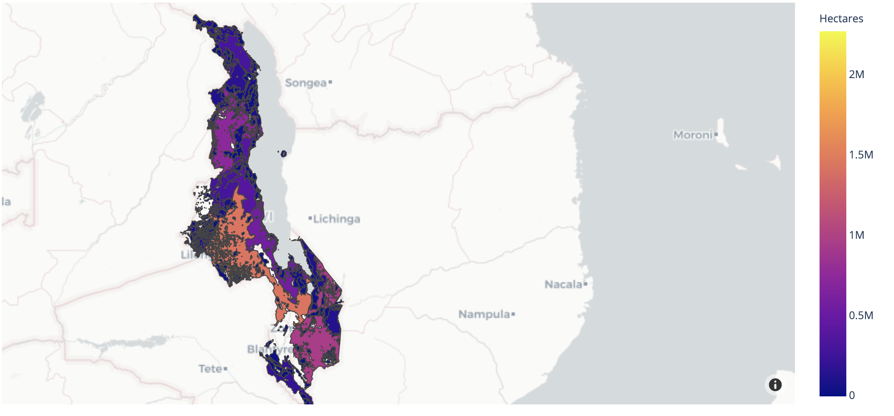
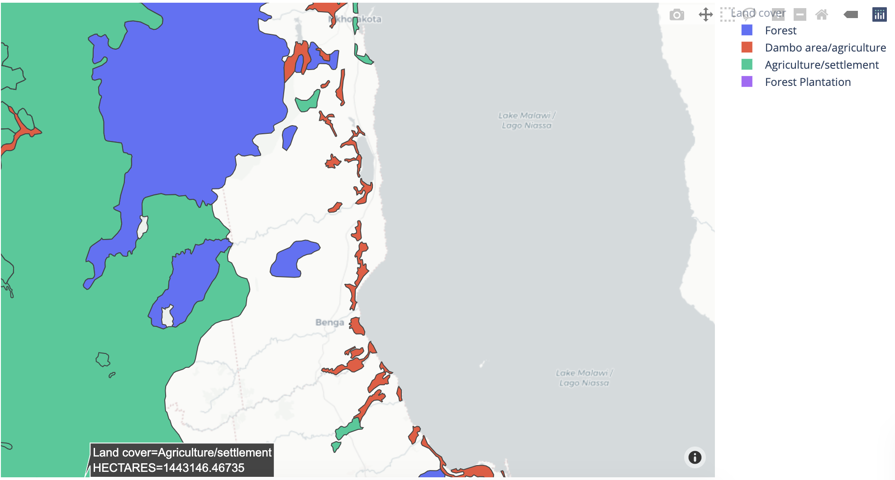

# Visualization of geospatial data using plotlyexpress and geopandas

This repo shows how to use geojson data for spatial and metadata using plotlyexpress and geopandas in Jupyter Notebook.

Data were obtained from the ArcGIS Hub and provide details of the various types of landcover in Malawi as of 2010.

